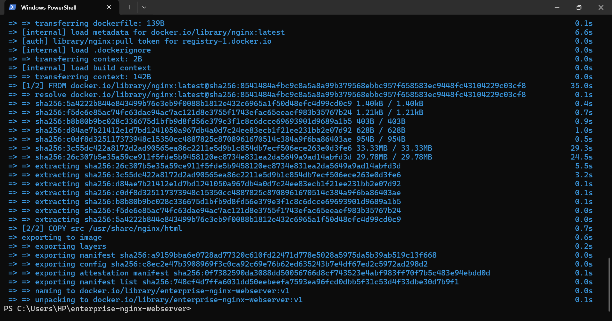
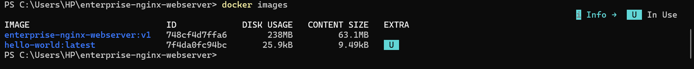
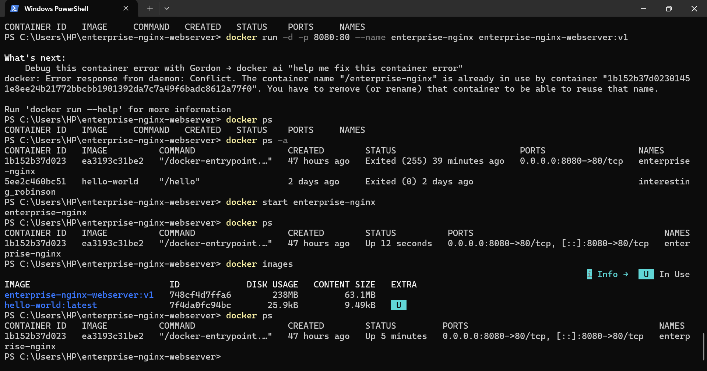
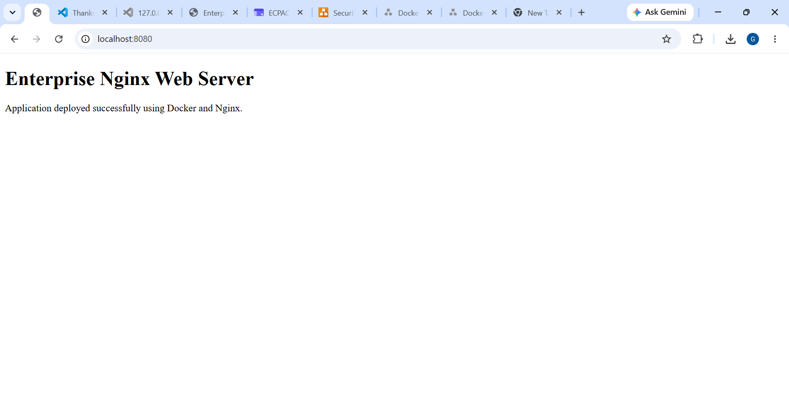
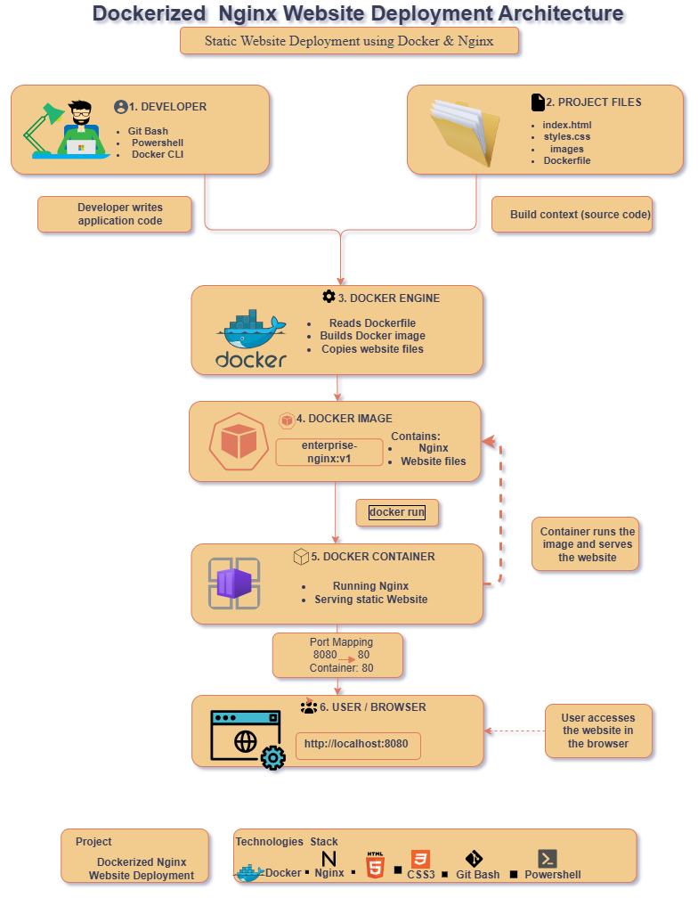

# Dockerized Nginx Website Deployment

A containerized web application built with Docker and Nginx. This project demonstrates how to package, deploy, and serve a static website using a lightweight and portable containerized architecture.

## Project Overview

This project demonstrates a simple DevOps deployment workflow using Docker and Nginx. The website source code is packaged into a custom Docker image and deployed as a Docker container running an Nginx web server. The application is exposed on port **8080**, making it accessible through a web browser.

## Technology Stack

- Docker
- Nginx
- HTML5
- CSS3
- JavaScript
- Git
- GitHub

## Project Structure

```text
docker-nginx-web-deployment/
│
├── docker/
│   └── Dockerfile
│
├── docs/
│   └── docker-architecture-diagram.png
│
├── screenshots/
│   ├── docker-build.png
│   ├── docker-images.png
│   ├── docker-container-running.png
│   └── website-preview.png
│
├── scripts/
│
├── src/
│   ├── css/
│   ├── images/
│   ├── js/
│   └── index.html
│
└── README.md
```

## Getting Started

### Clone the Repository

```bash
git clone https://github.com/gensfit-collab/docker-nginx-web-deployment.git
```

### Navigate to the Project

```bash
cd docker-nginx-web-deployment
```

### Build the Docker Image

```bash
docker build -f docker/Dockerfile -t enterprise-nginx-webserver:v1 .
```

### Run the Container

```bash
docker run -d -p 8080:80 --name enterprise-nginx enterprise-nginx-webserver:v1
```

### Access the Application

Open your browser and visit:

```text
http://localhost:8080
```

## Deployment Evidence

The screenshots below demonstrate the successful containerization and deployment of the application.

### Docker Image Build



### Docker Image Verification



### Running Container



### Website Preview



## Architecture

The application follows a containerized deployment workflow. The website source code is packaged into a Docker image using a Dockerfile. Docker creates the image and runs it as a container with Nginx serving the application. The container exposes port **8080**, allowing users to access the website from a web browser.

### Architecture Diagram



## Future Improvements

- Automate deployment using GitHub Actions
- Deploy the application to Microsoft Azure
- Orchestrate containers with Kubernetes
- Configure HTTPS with SSL/TLS
- Add monitoring and centralized logging

## Author

**Genesis Ojonukpe Peter**

Cloud & DevOps Engineer